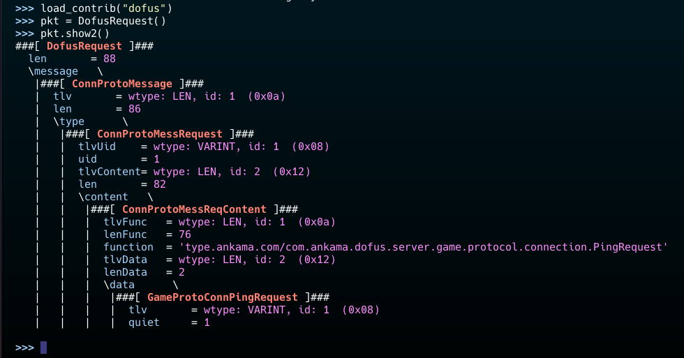
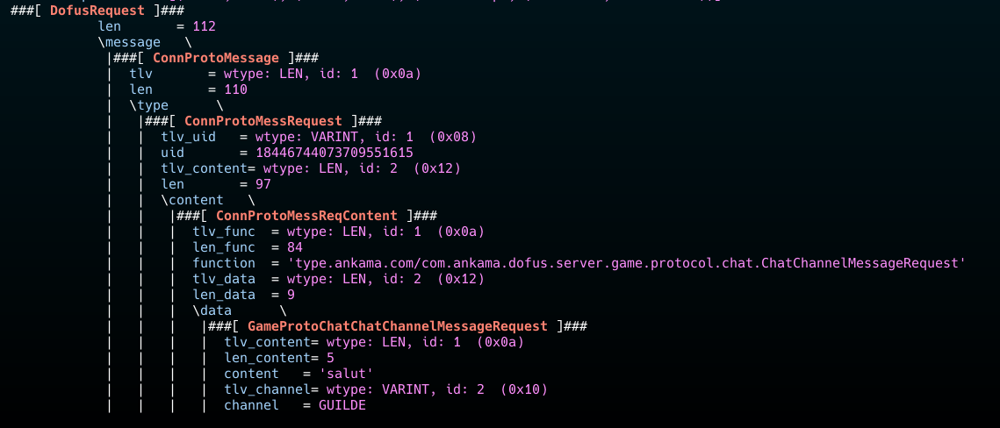

# D3Parsers

This repo contains Scapy dissector for Dofus Unity protocol.

Dissector support TCP fragmentation.

For the moment, they are incomplete, but will be updated frequently.

## How to install

To download the repo do :

```bash
git clone https://github.com/lk740/D3Parsers.git
```


### Scapy dissector

To add `dofus.py` to Scapy, you need to copy the file into the `contrib` folder of Scapy.

The path depends of you installation.

After that, you can use the dissector in Scapy by typing :

```python 
>>> load_contrib("dofus")
```

Or import it directly in your script :

```python
from scapy.contrib.dofus import *
```

## Getting Started


Basic creation of a Dofus packet :



Example of packet dissection :




## Disclaimer

**These tools are for educational use only !** I am in no way responsible for the use you make of them. 

## Contributing

This project is currently under development. I am open to any improvements or advice.

